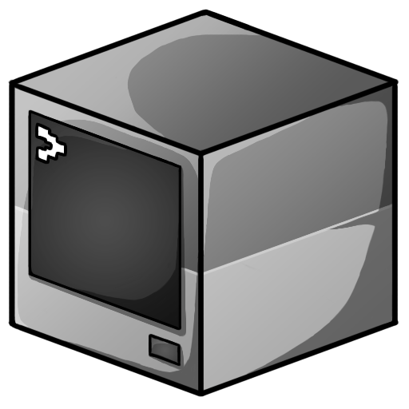

    
    <h1 align="center">BetaLander</h1>

**This server was built with [Spigot](https://www.spigotmc.org/) in [Java](https://www.java.com/en/). This server works as plugin modular, so don't worry about adding your own plugins. It will not affect to the server's working process. Just, don't forget to restart server and you're ready to go!
If you want to create your own server with my codes, just head to the [Deploy your own](#deploy-your-own) section.**
 
## Deploy Your Own
**To deploy your own server with my instances follow the steps provided below**

### ON WINDOWS
<ol>
<li> You have two options to proceed with server manager, install or use it remotely.
<ul><li> To install <strong>CLI</strong>, execute  
    
<kbd>
        deno install --unstable --allow-all --name=betalander https://raw.githubusercontent.com/genemators/betalander/master/mod.ts</kbd>
    
</li></ul>
<ul><li> To use it <strong>remotely</strong>  
    
<kbd>
        deno run --allow-all --unstable https://raw.githubusercontent.com/genemators/betalander/master/mod.ts build</kbd>
    
</li></ul>
<li> If you installed <strong>CLI</strong>, spawn <kbd>cmd</kbd> in any folder
   and type <kbd>betalander build</kbd> then proceed with installation. 
   If you used the <strong>remote</strong> session, proceed with it and it will create server file.
<li> Enter the folder
<li> Run <kbd>start.bat</kbd> file
<li> Wait until it starts for the first time!
<li> Open minecraft
<li> Add new server with <kbd>localhost:25565</kbd> credential
<li> Voila! You're ready to go!
</ol>

> **Attention**
> In order to update server file,
> spawn <kbd>cmd</kbd> session on server folder
> then type <kbd>betalander update</kbd>
> **or** just execute <kbd>update.cmd</kbd> file!

### ON LINUX
<ol>
<li> You have two options to proceed with server manager, install or use it remotely.
<ul><li> To install <strong>CLI</strong>, execute  
    
<kbd>
        deno install --unstable --allow-all --name=betalander https://raw.githubusercontent.com/genemators/betalander/master/mod.ts</kbd>
    
</li>
    <li> To use it <strong>remotely</strong>  
    
<kbd>
        deno run --allow-all --unstable https://raw.githubusercontent.com/genemators/betalander/master/mod.ts build</kbd>
    
</li></ul>
<li> If you installed <strong>CLI</strong>, spawn new terminal in any folder
   and type <kbd>betalander build</kbd> then proceed with installation.
   If you used the <strong>remote</strong> session, proceed with it and it will create server file.
<li> Enter the folder
<li> Run <kbd>start.sh</kbd> file
<li> Wait until it starts for the first time!
<li> Open minecraft
<li> Add new server with <kbd>localhost:25565</kbd> credential
<li> Voila! You're ready to go!
</ol>

> **Attention**
> In order to update server file,
> spawn <kbd>cmd</kbd> session on server folder
> then type <kbd>betalander update</kbd>
> or just execute <kbd>update.sh</kbd> file!

## Sharing server between localhost or public

### If you live in country where every citizen have public ip adress do the following
For **localhost**  
1. Open _CMD_, _Powershell_ or _terminal_
2. Type (for Windows) <kbd>ipconfig</kbd> or (for Linux/Ubuntu) <kbd>ifconfig</kbd>
3. Find your IPv4 adress connecting you to your router
4. Share your adress in this form <kbd><ip>:25565</kbd>
   - Example: <kbd>192.168.1.2:25565</kbd> or <kbd>10.10.0.2:25565</kbd>

For **public**  
1. Open browser
2. Type <kbd>what's my ip</kbd>
3. Copy address
4. Enter router
5. Port forward internal <kbd>25565</kbd> to outer <kbd>25565</kbd>
4. Share the result like this <kbd><ip>:25565</kbd>

### If you live in a country where the whole country uses a single ip adress like me do the following
For localhost do the same as I mention below in public one, but for public you need to do something more extra <ol>
<li> Download ngrok from [download sources](#download-sources)
<li> <a href="https://ngrok.com/">Open ngrok homepage</a>
<li> Register and follow guides from ngrok
<li> When you finish setting up your ngrok instance execute this
    
<kbd>
        ./ngrok tcp 25565</kbd>
    

<li> Copy ip adress and share it.
</ol>

## Download Sources
<a href="https://bin.equinox.io/c/4VmDzA7iaHb/ngrok-stable-windows-amd64.zip">Download ngrok package (Win x64)</a>
 <a href="https://bin.equinox.io/c/4VmDzA7iaHb/ngrok-stable-linux-amd64.zip">Download ngrok package (Linux x64)</a>

## Documentations
- **Spigot**  
    [Wiki](https://www.spigotmc.org/wiki/spigot)
- **Ngrok**  
    [Website](https://ngrok.com/docs)

---
> The server page is still in beta phase so feel free to [open issues](https://github.com/genemtors/betalander/issues/new) and give me some suggestions.
---
> **Important Note**
> Under the MIT license, if you're running your own instance,
> you should add a link to the source [(this repository)](https://github.com/genemators/betalander)
> in your bot's bio or about page.
> If you're modifying this source and making your own bot,
> you should link to the source of your own version of the bot according to the MIT license.
> **Check** [LICENSE](LICENSE) for more info.

<footer>

 <a href="https://bsba.uz"><b>BetaCraft</b></a> icon is from
 <a href="https://t.me/genemator/">Genemator Sakhib</a> by Sokhibjon Orzikulov.
  Copyright to <a href="https://bsba.uz/genemator"><b>BSBA TEAM</b></a>

</footer>
